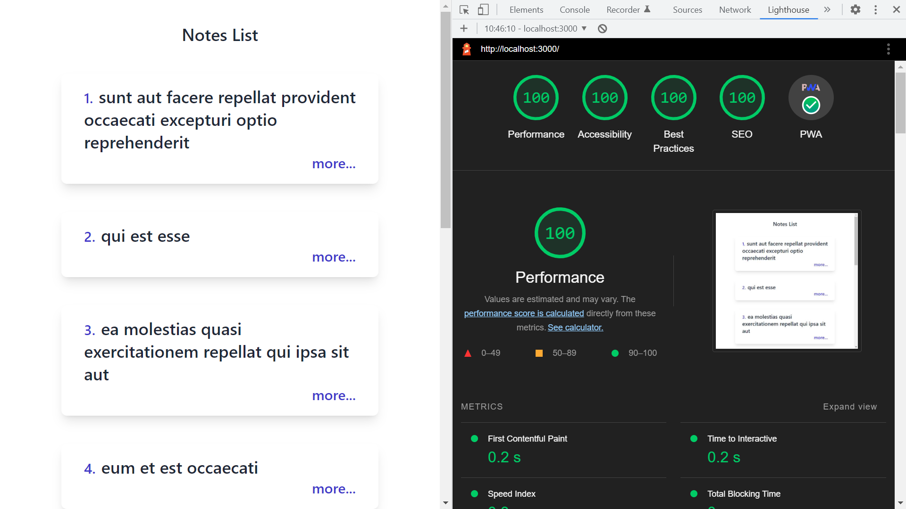
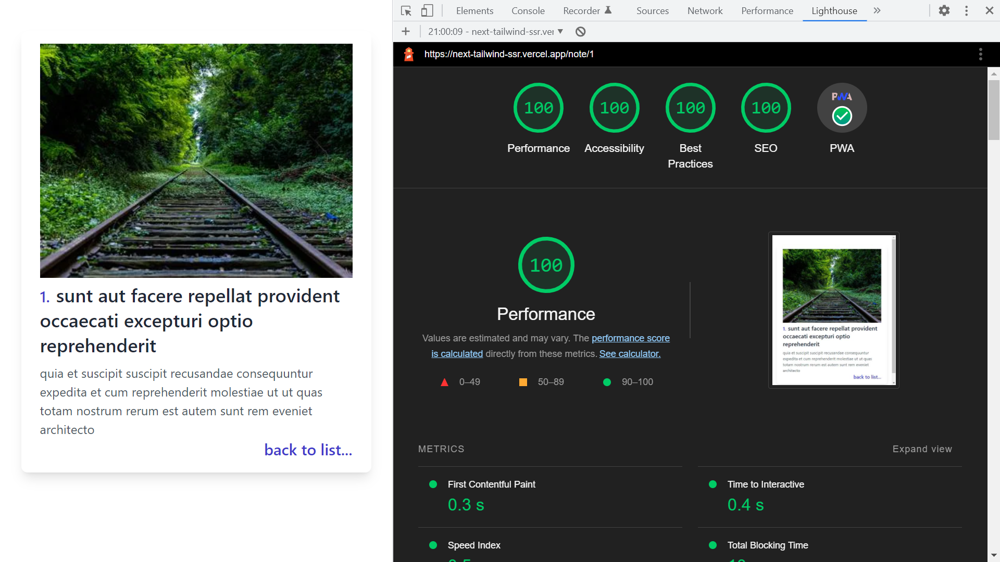

# :zap: Next Tailwind SSR

* A Next/Tailwind SSR PWA app displaying API data in a card list
* Clicking on a card navigates to a page with the full card datta & a random image
* **Note:** to open web links in a new window use: _ctrl+click on link_


## :page_facing_up: Table of contents

* [:zap: Next Tailwind SSR](#zap-next-tailwind-ssr)
  * [:page_facing_up: Table of contents](#page_facing_up-table-of-contents)
  * [:books: General Info](#books-general-info)
  * [:camera: Screenshots](#camera-screenshots)
  * [:signal_strength: Technologies](#signal_strength-technologies)
  * [:floppy_disk: Setup](#floppy_disk-setup)
  * [:computer: Code Examples](#computer-code-examples)
  * [:cool: Features](#cool-features)
  * [:clipboard: Status & To-Do List](#clipboard-status--to-do-list)
  * [:clap: Inspiration](#clap-inspiration)
  * [:file_folder: License](#file_folder-license)
  * [:envelope: Contact](#envelope-contact)

## :books: General Info

* Next.js used for frontend is for server-rendered react apps. It has automatic code splitting, simple page-based routing, built-in CSS support and hot reloading.
* Tailwind CSS added to Next.js
* [Picsum API](https://picsum.photos) random photo is displayed
* Latest Next/Image optimisation used so image downloaded as Webp format and automatically sized. This is a major advantage over non-optimised Images.
* Converted to Progressive Web App (PWA).
* [Custom `Document`](https://nextjs.org/docs/advanced-features/custom-document) file `./pages/_document.js` created to override and extend default `Document`. It injects meta tags into every page
* Project Structure:

```bash
├── .eslintrc.json
├── next.config.js
├── package.json
├── pages
│  ├── _app.js
│  ├── _document.js
│  ├── api
│  │  ├── hello.js
│  │  └── revalidate.js
│  ├── index.js
│  └── note
│    └── [id].js
├── postcss.config.js
├── revalidate.sh
├── styles
│  ├── globals.css
│  └── Home.module.css
└── tailwind.config.js
```

## :camera: Screenshots




## :signal_strength: Technologies

* [React v17](https://reactjs.org/) Javascript library.
* [Next v12](https://nextjs.org/) minimalist framework for rendering react apps on the server.
* [Tailwind CSS v3](https://tailwindcss.com/) utility-first CSS framework
* [PostCSS v8](https://postcss.org/) tool for transforming CSS with JavaScript
* [pngTree](https://pngtree.com/) downloadable images, png etc.
* [pwa-asset-generator v4](https://www.npmjs.com/package/pwa-asset-generator) Automated PWA asset generation and image declaration. Creates icons and JSON array for PWA manifest.json file
* [Picsum API random image](https://picsum.photos/images). No API key required, image size can be specified in url
* [Vercel](https://vercel.com/docs/concepts/deployments/overview) deployment

## :floppy_disk: Setup

* `npm run dev` runs the app in the development mode. Open [http://localhost:3000](http://localhost:3000) to view it in the browser.
* `npm run build` builds the app for production to the `build` folder. It correctly bundles React in production mode and optimizes the build for the best performance. The build is minified and the filenames include the hashes. Note: Github deploys this app after every commit and build files are recreated automatically by Vercel.
* `npm run start` to run the built app.

## :computer: Code Examples

* `note/[id].js` function to get static paths - required for Static Site Generation

```javascript
export async function getStaticPaths() {
  const resp = await fetch(
    "https://jsonplaceholder.typicode.com/posts?userId=1"
  );
  const cards = await resp.json();

  return {
    paths: cards.map((card) => ({
      params: {
        id: card.id.toString()
      }
    })),
    fallback: false,
  };
}
```

## :cool: Features

* 100% Lighthouse score for both pages

## :clipboard: Status & To-Do List

* Status: Working. Deployed to Vercel.
* To-Do: Add content

## :clap: Inspiration

* [Install Tailwind CSS with Next.js](https://tailwindcss.com/docs/guides/nextjs)
* [Stackoverflow: Next.JS "Link" vs "router.push()" vs "a" tag](https://stackoverflow.com/questions/65086108/next-js-link-vs-router-push-vs-a-tag)

## :file_folder: License

* This project is licensed under the terms of the MIT license.

## :envelope: Contact

* Repo created by [ABateman](https://github.com/AndrewJBateman), email: gomezbateman@yahoo.com
